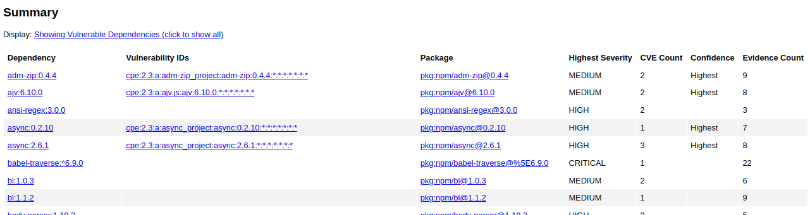
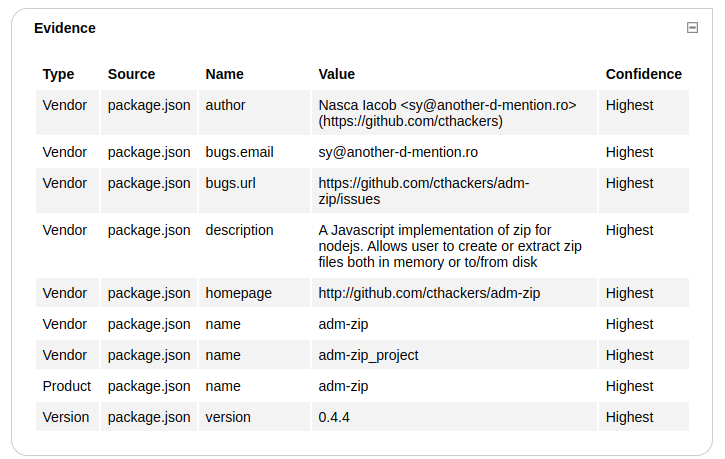

# OWASP Dependency-check

Yet another OWASP tool to do dependency checking. This one also requires access to several externally hosted resources.

In order to analyze some technology stacks dependency-check may require other development tools to be installed. For this purpose we have only installed a few (yarn, pnpm, go, etc).

The documentation suggests you obtain an National Vulnerability API Key from [NIST](https://nvd.nist.gov/developers/request-an-api-key) in order to download the database faster. It really takes only just a minute. Even with the API key the database takes a while.

```bash
wanderer@trg ~ $ dependency-check --scan NodeGoat --out . --nvdApiKey 4fde7776-c644-4db0-a135-0b7b2a485317
[INFO] Checking for updates
[INFO] NVD API has 266,355 records in this update
[INFO] Downloaded 10,000/266,355 (4%)
[INFO] Downloaded 20,000/266,355 (8%)
[INFO] Downloaded 30,000/266,355 (11%)
```

It is mandatory to do it the first time, otherwise you'll get an error saying the database does not exist, since it heavily relies on this.

Afterward, you can run it again

```bash
wanderer@trg ~ $ dependency-check --noupdate --scan NodeGoat --out .
# or
dependency-check -n -s NodeGoat --out .
```

If you were to open the output from a browser, you'll see among the parameters of execution, the following summary.



And for each vulnerable dependency, an excerpt like this one:


You can even expand some of the information like Evidence, and Related dependencies:



It includes recommendation and sources of information from where it grabbed them in the first place to conduct the analysis.
