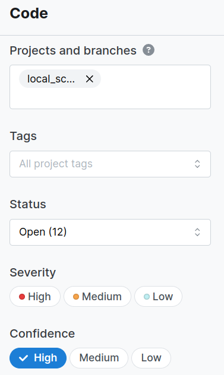
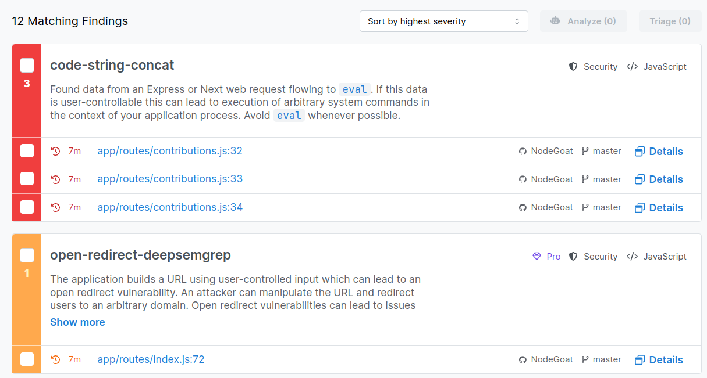
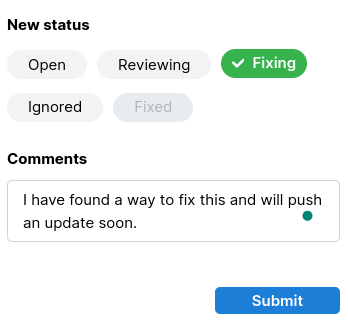

# Semgrep

You already know we like [**Semgrep**](https://semgrep.dev/), but in our previous example we just ran it to scan for secrets. Thing is, I did not tell you how amazing it by default:

```bash
wanderer@trg NodeGoat $ semgrep scan .
┌──── ○○○ ────┐
│ Semgrep CLI │
└─────────────┘

Scanning 117 files (only git-tracked) with:

✔ Semgrep OSS
  ✔ Basic security coverage for first-party code vulnerabilities.

✘ Semgrep Code (SAST)
  ✘ Find and fix vulnerabilities in the code you write with advanced scanning and expert security rules.

✘ Semgrep Supply Chain (SCA)
  ✘ Find and fix the reachable vulnerabilities in your OSS dependencies.

💎 Get started with all Semgrep products via `semgrep login`.
✨ Learn more at https://sg.run/cloud.

  ━━━━━━━━━━━━━━━━━━━━━━━━━━━━━━━━━━━━━━━╸  99% 0:00:01

...
    ❯❱ javascript.browser.security.eval-detected.eval-detected
          Detected the use of eval(). eval() can be dangerous if used to evaluate dynamic content. If this
          content can be input from outside the program, this may be a code injection vulnerability. Ensure
          evaluated content is not definable by external sources.
          Details: https://sg.run/7ope

           33┆ const afterTax = eval(req.body.afterTax);
...

┌──────────────┐
│ Scan Summary │
└──────────────┘
Some files were skipped or only partially analyzed.
  Scan was limited to files tracked by git.
  Partially scanned: 12 files only partially analyzed due to parsing or internal Semgrep errors
  Scan skipped: 1 files larger than 1.0 MB, 36 files matching .semgrepignore patterns
  For a full list of skipped files, run semgrep with the --verbose flag.

Ran 259 rules on 80 files: 38 findings.
💎 Missed out on 886 pro rules since you aren't logged in!
⚡ Supercharge Semgrep OSS when you create a free account at https://sg.run/rules.
```

As you can see, it has a generic ruleset that scans for any kind of vulnerability inside any project. But most rles are restricted unless you log into the platform, which you can do quick and easy as follows:

```bash
wanderer@trg NodeGoat $  semgrep login
Login enables additional proprietary Semgrep Registry rules and running custom policies from Semgrep Cloud Platform.
Opening login at: https://semgrep.dev/login?cli-token=c682a3f1-d734-4b66-bf45-f843b3225dd3&docker=False&gha=False

Once you've logged in, return here and you'll be ready to start using new Semgrep rules.
```

The followoing image will pop up, and when you press activate you're ready. If this is your first time you will need to register.


```bash
Once you've logged in, return here and you'll be ready to start using new Semgrep rules.
Saved login token

 1234567890abcdef1234567890abcdef1234567890abcdef1234567890abcdef

in /home/wanderer/.semgrep/settings.yml.
Note: You can always generate more tokens at https://semgrep.dev/orgs/-/settings/tokens
```

If we run the scanner again, you will see a difference on the amount of rules ran for this project, and in this case, the findings.

```bash
Some files were skipped or only partially analyzed.
  Scan was limited to files tracked by git.
  Partially scanned: 12 files only partially analyzed due to parsing or internal Semgrep errors
  Scan skipped: 1 files larger than 1.0 MB, 36 files matching .semgrepignore patterns
  For a full list of skipped files, run semgrep with the --verbose flag.

Ran 323 rules on 80 files: 41 findings.
```

Remember you can always go look for a custom [community ruleset](https://semgrep.dev/explore), or even [create your own](https://semgrep.dev/learn)!

There's another feature, which I think it's the best, which is `ci`.

```bash
wanderer@trg NodeGoat $ semgrep ci


┌────────────────┐
│ Debugging Info │
└────────────────┘

  SCAN ENVIRONMENT
  versions    - semgrep 1.91.0 on python 3.11.2
  environment - running in environment git, triggering event is unknown

  CONNECTION
  Initializing scan ...
```

If you go to the semgrep platform, inside the Projects folder you will see that a local_scan on NodeGoat is In Progress.

 

This scan, will eventually enable some of their products, download necessary engines to run, and run them. You will be able to see everything beautifully displayed on the web platform.

```bash
  CONNECTION
  Initializing scan (deployment=mockup-org, scan_id=42109875)
  Enabled products: Code, Supply Chain

  ENGINE
Semgrep Pro Engine will be installed in /home/wanderer/.local/pipx/venvs/semgrep/lib/python3.11/site-packages/semgrep/bin/semgrep-core-proprietary

Successfully installed Semgrep Pro Engine (version 1.91.0)!

  Scanning 117 files (only git-tracked) with 1941 Code rules, 3598 Supply Chain rules:

  CODE RULES

  Language      Rules   Files          Origin      Rules
 ─────────────────────────────        ───────────────────
  <multilang>      68      80          Community    1055
  js              219      27          Pro rules     886
  html              1      26
  json              4       8
  yaml             29       4
  dockerfile        4       1


  SUPPLY CHAIN RULES

  Ecosystem   Rules   Files   Lockfiles
 ───────────────────────────────────────────────
  Npm          3598      83   package-lock.json


  Analysis       Rules
 ──────────────────────
  Basic           3029
  Reachability     569


  PROGRESS

  ━━━━━━━━━━━━━━━━━━━━━━━━━━━━━━━━━━━━━━━╸  99% 0:00:55
```

As you expect, there's a lot of output.

```bash
┌──────────────┐
│ Scan Summary │
└──────────────┘
CI scan completed successfully.
  Found 283 findings (0 blocking) from 22206 rules.
  Uploading scan results
  Finalizing scan
  View results in Semgrep Cloud Platform:
    https://semgrep.dev/orgs/mockup-org/findings?repo=local_scan/NodeGoat&ref=master
    https://semgrep.dev/orgs/mockup-org/supply-chain/vulnerabilities?repo=local_scan/NodeGoat&ref=master
  No blocking findings so exiting with code 0
```

But as we said, check out the platform!

There, you can apply filters:

<p align="center">
  
</p>

See matching findings:

<p align="center">
  
</p>

And triage them!

<p align="center">
  
</p>
