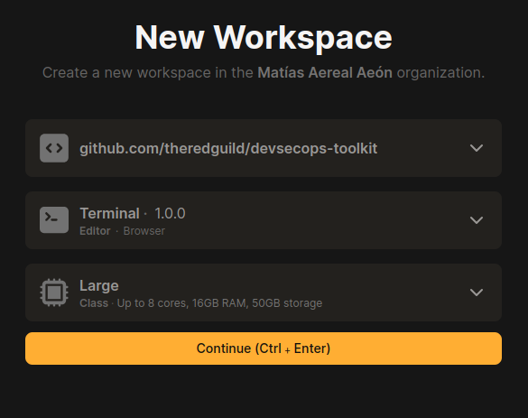

# Introduction

Hi! And welcome to the DevSecOops handbook. An educational approach, complementary to our [@theredguild/devsecops-toolkit](https://github.com/theredguild/devsecops-toolkit) where we provide practical aid on how to use some of the tools depicted there.


To start, you should have at least built the `workshop-minimal` image of that container.
There are several ways you could do this, but I'm going to show you only two, one remote and one local.

## Setup: Option 1 - GitPod (preferred)

Literally just [click here](https://gitpod.io/#https://github.com/theredguild/devsecops-toolkit) and that's almost it. I'd choose **Terminal**, **Large**, `Ctrl + Enter` and you're done. You just need to run `make exec`.

<p align="center">
  
</p>

Here we can build the entire repository from `develop` since connectivity issues won't be a problem.

## Setup: Option 2 - Local container

Clone the repo inside your computer, checkout `workshop-minimal`, and exec, easy peasy. Note that if you're in one of our workshops, inside a venue, things might go a tad slow.

```bash
git clone https://github.com/theredguild/devsecops-toolkit
git checkout workshop-minimal
make exec
```

## Start

Once you've built the container, you should be able to see something similar to this.

```plaintext
❯ make exec
fatal: No names found, cannot describe anything.
Running interactive shell inside the devsecops-toolkit container...
                    __        __   _                               
                    \ \      / /__| | ___ ___  _ __ ___   ___      
                     \ \ /\ / / _ \ |/ __/ _ \| '_ ` _ \ / _ \     
                      \ V  V /  __/ | (_| (_) | | | | | |  __/     
                    __ \_/\_/ \___|_|\___\___/|_| |_| |_|\___|     
                    \ \      / /_ _ _ __   __| | ___ _ __ ___ _ __ 
                     \ \ /\ / / _` | '_ \ / _` |/ _ \ '__/ _ \ '__|
                      \ V  V / (_| | | | | (_| |  __/ | |  __/ |   
                       \_/\_/ \__,_|_| |_|\__,_|\___|_|  \___|_|   

                         Welcome to the devsecops toolkit
                            Built by The Red Guild 🪷

    This container was created as a resource for a workshop, 
    which intends to spread awareness, help people protect themselves 
    and the repos they interact with. Say hi @theredguild!, don't be a stranger.

wanderer@trg ~ $ 
```

And now you're ready to follow the rest of the chapters! We hope you like it.

## Disclaimer

As we mentioned above, this is an educational repository, which currently includes the content of this practical handbook. In the future, it may also feature more specific selected examples to test each tool.

Our focus has recently shifted more towards operational security, so we haven't used these tools daily or to their full extent. However, they are a selection and curation of our own after thorough research, testing, and consulting with others :).

If you're looking for more tools, you can check out `develop`, but be aware that in its current state, it weighs nearly 9GB. The `workshop-minimal` version should not exceed 3.5GB.

Once you've grasped how and where to use them, you might want to explore further to extract all the juice, or even use them separately, most of them include their own separate container.
